# OOPS + DMA — My Mental Model

**Every box has a value (inside) and an address (below).**

## Class basics

### The code (from classes.cpp)

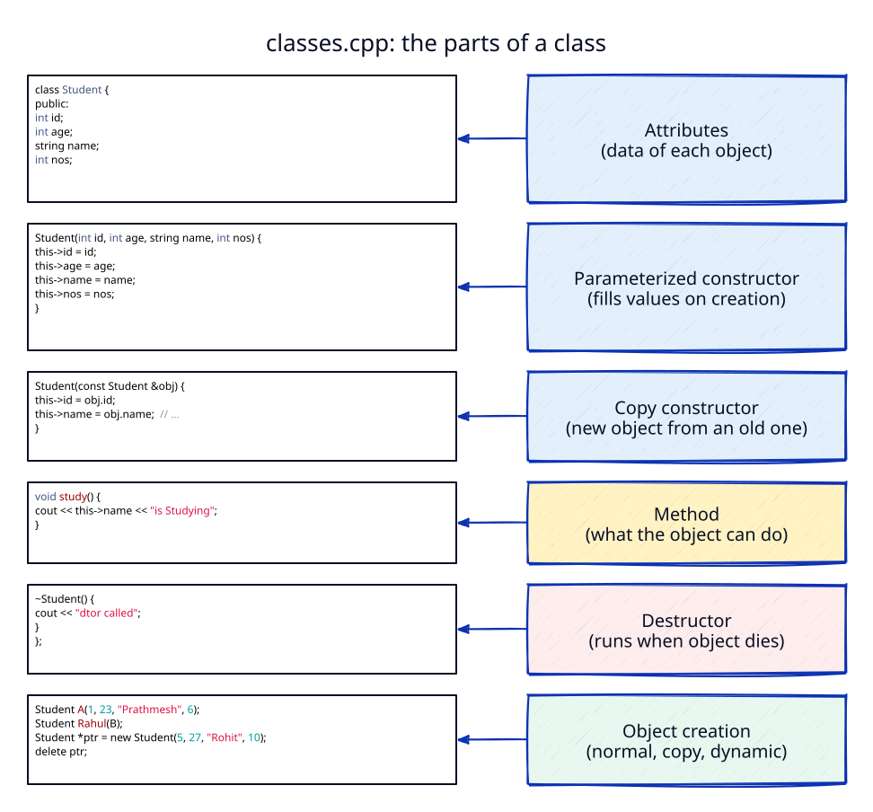

### Class & object creation


### Constructors: default & parameterized


- Same name as the class, no return type.
- If you write a parameterized ctor, C++ does **not** give you a default one. Add `Student() {}` if you need `Student s;`.

### What `this->id` means


### Copy constructor


### Methods & destructor


Inside a method, `this` → the object that called it (`A.study()` → `this` = A).

---

# DMA

## 1. Pointer


- `&a` = **address of variable a**
- `a  = 5` (value inside) | `&a = 602` (where it is)
- `*` is the **dereference operator**: `*ptr` = go to the address in ptr and use that box.

## 2. Putting a value into dynamic memory



Shortcut: `int *ptr = new int(50);` does both steps in one line.

## 3. Dynamic memory allocation (objects)


`new` makes the object and gives back its address → the pointer stores that address.

## Remember

- Pointer box ≠ object box. They are two separate boxes.
- Object → `.` | Pointer → `->`
- `new` → `delete` | `new[]` → `delete[]`

---

# Encapsulation

## What is encapsulation

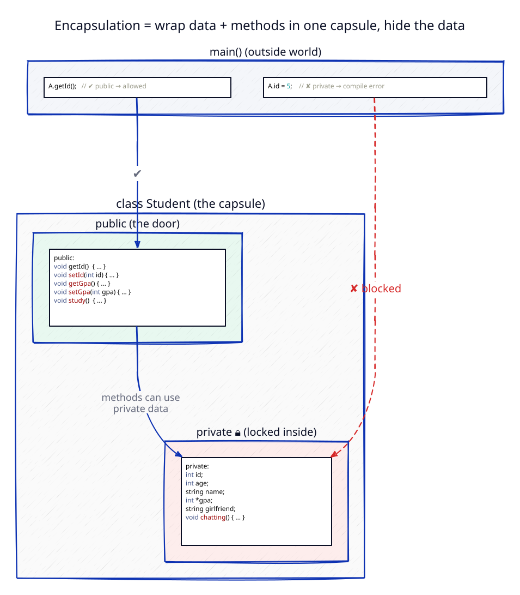

Put the data **and** the methods that use it in one capsule (the class). Keep the data `private`, and open only a few `public` methods as the door.

## Access modifiers

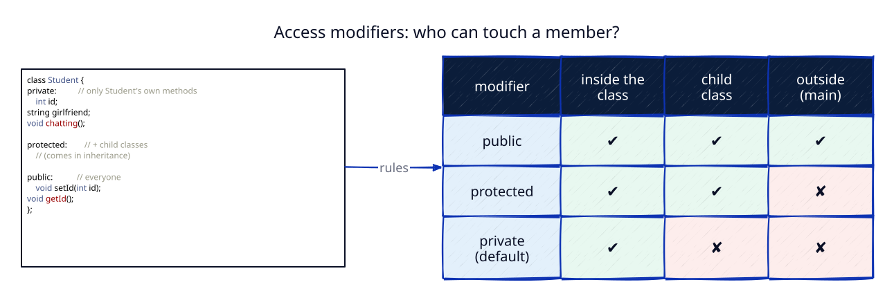

- In a `class`, members are `private` unless you say otherwise.
- `A.id = 5;` → compile error, because `id` is private.

## Getters & setters

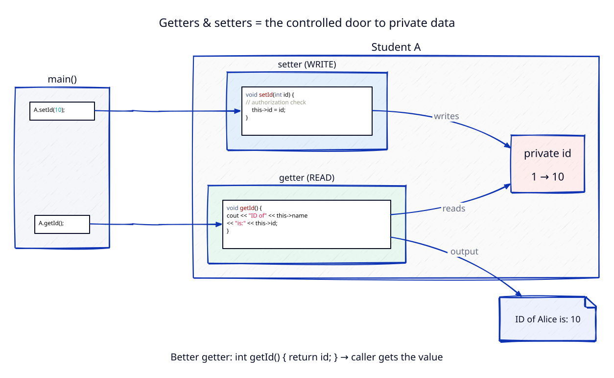

- **Setter** = the only way to change private data, and it can check first (`// authorization check`).
- **Getter** = read-only access. Usually it **returns** the value: `int getId() { return id; }`.
- `gpa` is an `int*` → `new int(gpa)` in the ctor, `delete gpa` in the dtor (DMA inside a class).
